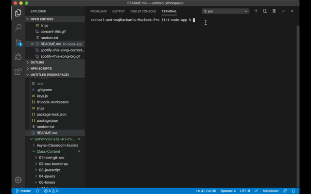

# liri-node-app
LIRI is like iPhone's SIRI. However, while SIRI is a Speech Interpretation and Recognition Interface, LIRI is a Language Interpretation and Recognition Interface. 

LIRI is a command line node app that takes in parameters and gives you back data.

Liri can take four different commands. 

1. spotify-this-song [song name] - This command will utilize the spotify API to access information about the song name entered by the user and also provide an external link to open in Spotify when available. If no song name is entered with this command, information for "The Sign" by Ace of Bass will be returned. At this time, the limit for results returned is set to five otherwise.

2. movie-this [movie name] - This command will pull information about the movie name entered by the user. If no movie name is entered, it will default to Mr. Nobody. 

3. concert-this [artist or band name] - This command will use the bands-in-town API to return the first five results for touring information. If the band/artist is not currently touring, it will let the user know that. 

4. do-what-it-says - This command will read the file random.txt and utilize the command and provided search term inside of the file. 

To use Liri, you will need node installed as well as the following npm packages

    "axios": "^0.19.2",
    "fs": "0.0.1-security",
    "dotenv": "^8.2.0",
    "moment": "^2.24.0",
    "node-spotify-api": "^1.1.1",
    "spotify-web-api-node": "^4.0.0"

You will also need your own .env file. Inside your .env you will need your own spotify client ID and password. These can be obtained at https://developer.spotify.com/my-applications/#!/. You should then save them in this format in your .env file: 

//SPOTIFY_ID= [YOUR - CLIENT - ID - HERE]
//\nSPOTIFY_SECRET=[YOUR - SPOTIFY - SECRET - HERE]

---------------------------------

EXAMPLES: 

spotifiy-this-song: 

</img>

concert-this: 

</img>

movie-this: 

</img>

do-what-it-says: 

</img>

